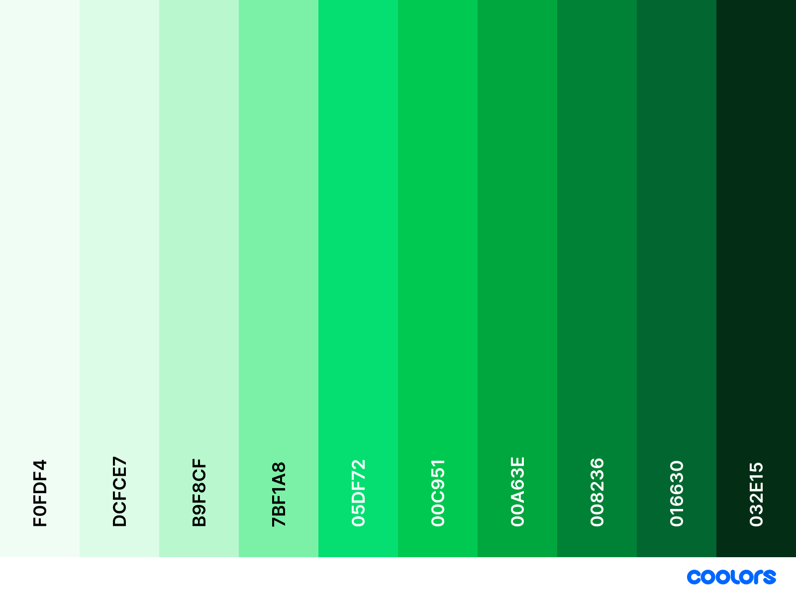

# Cores

## Cores Institucionais

As cores da identidade visual do AuRORA foram desenvolvidas para refletir os valores do projeto e sua relação com o ambiente tecnológico e acadêmico da Universidade de Brasília. A paleta combina tonalidades de verde e azul, reforçando a conexão com a identidade visual da Universidade de Brasília, porém com leves alterações para refletir o aspecto tecnológico do projeto.

## Paleta Verde (Primária Institucional)

### Usos recomendados

- Logo principal
- Botões de ação (CTA)
- Componentes-chave da interface

### Escala

<figure markdown="span">  
  { width="600" }
  <figcaption>Figura 1 - Paleta primária. Fonte: Autor.</figcaption>
</figure>

  <table>
    <thead>
      <tr>
        <th>Tonalidade</th>
        <th>HEX</th>
      </tr>
    </thead>
    <tbody>
      <tr>
        <td>primary-50</td>
        <td>#E6F6F1</td>
      </tr>
      <tr>
        <td>primary-100</td>
        <td>#C2E9DE</td>
      </tr>
      <tr>
        <td>primary-200</td>
        <td>#9FDBCA</td>
      </tr>
      <tr>
        <td>primary-300</td>
        <td>#7CCEB7</td>
      </tr>
      <tr>
        <td>primary-400</td>
        <td>#59C0A4</td>
      </tr>
      <tr>
        <td>primary-500</td>
        <td>#36B391</td>
      </tr>
      <tr>
        <td>primary-600</td>
        <td>#1EA683</td>
      </tr>
      <tr>
        <td>primary-700</td>
        <td>#009F76</td>
      </tr>
      <tr>
        <td>primary-800</td>
        <td>#008B68</td>
      </tr>
      <tr>
        <td>primary-900</td>
        <td>#006E51</td>
      </tr>
    </tbody>
  </table>

    <figcaption>Tabela 1 - Paleta primária. Fonte: Autor.</figcaption>

## Paleta Azul (Secundária )

### Usos recomendados

- Backgrounds de seções
- Header fixo (dark mode e light)
- Títulos secundários
- Bordas, ícones e divisores
- Elementos relacionados à pesquisa e dados

### Escala

<figure markdown="span">  
  { width="600" }
  <figcaption>Figura 2 - Paleta segundária. Fonte: Autor.</figcaption>
</figure>

  <table>
    <thead>
      <tr>
        <th>Tonalidade</th>
        <th>HEX</th>
      </tr>
    </thead>
    <tbody>
      <tr>
        <td>primary-50</td>
        <td>#E6F6F1</td>
      </tr>
      <tr>
        <td>primary-100</td>
        <td>#C2E9DE</td>
      </tr>
      <tr>
        <td>primary-200</td>
        <td>#9FDBCA</td>
      </tr>
      <tr>
        <td>primary-300</td>
        <td>#7CCEB7</td>
      </tr>
      <tr>
        <td>primary-400</td>
        <td>#59C0A4</td>
      </tr>
      <tr>
        <td>primary-500</td>
        <td>#36B391</td>
      </tr>
      <tr>
        <td>primary-600</td>
        <td>#1EA683</td>
      </tr>
      <tr>
        <td>primary-700</td>
        <td>#009F76</td>
      </tr>
      <tr>
        <td>primary-800</td>
        <td>#008B68</td>
      </tr>
      <tr>
        <td>primary-900</td>
        <td>#006E51</td>
      </tr>
    </tbody>
  </table>

    <figcaption>Tabela 2 - Paleta secundária. Fonte: Autor.</figcaption>

## Paleta Vermelha - Erros 

### Usos recomendados 

- Validações de formulário com erro
- Mensagens como “não foi possível carregar”, “falha ao salvar”
- Indicadores de status crítico
- Barras ou badges de erro
- Botões como “Excluir”, “Cancelar operação perigosa”

### Escala 

<figure markdown="span">  
  { width="600" }
  <figcaption>Figura 3 - Paleta vermelha . Fonte: Autor.</figcaption>
</figure>

  <table>
    <thead>
      <tr>
        <th>Tonalidade</th>
        <th>HEX</th>
      </tr>
    </thead>
    <tbody>
      <tr>
        <td>error-50</td>
        <td>#FEF2F2</td>
      </tr>
      <tr>
        <td>error-100</td>
        <td>#FFE2E2</td>
      </tr>
      <tr>
        <td>error-200</td>
        <td>#FFC9C9</td>
      </tr>
      <tr>
        <td>error-300</td>
        <td>#FFA2A2</td>
      </tr>
      <tr>
        <td>error-400</td>
        <td>#FF6467</td>
      </tr>
      <tr>
        <td>error-500</td>
        <td>#FB2C36</td>
      </tr>
      <tr>
        <td>error-600</td>
        <td>#E7000B</td>
      </tr>
      <tr>
        <td>error-700</td>
        <td>#C10007</td>
      </tr>
      <tr>
        <td>error-800</td>
        <td>#9F0712</td>
      </tr>
      <tr>
        <td>error-900</td>
        <td>#82181A</td>
      </tr>
    </tbody>
  </table>

    <figcaption>Tabela 3 - Paleta vermelha. Fonte: Autor.</figcaption>

## Paleta Laranja - Warnings 

### Usos recomendados 

- Mensagens de “atenção”, “verifique isto”, “confirme ação”
- Informações que pedem cuidado, mas não interrompem o fluxo
- Indicadores de status intermediário
- Badges e banners de aviso
- Botões de ações moderadas

### Escala 

<figure markdown="span">  
  { width="600" }
  <figcaption>Figura 4 - Paleta laranja . Fonte: Autor.</figcaption>
</figure>

  <table>
    <thead>
      <tr>
        <th>Tonalidade</th>
        <th>HEX</th>
      </tr>
    </thead>
    <tbody>
      <tr>
        <td>warning-50</td>
        <td>#FFF7ED</td>
      </tr>
      <tr>
        <td>warning-100</td>
        <td>#FFEDD4</td>
      </tr>
      <tr>
        <td>warning-200</td>
        <td>#FFD6A8</td>
      </tr>
      <tr>
        <td>warning-300</td>
        <td>#FFB86A</td>
      </tr>
      <tr>
        <td>warning-400</td>
        <td>#FF8904</td>
      </tr>
      <tr>
        <td>warning-500</td>
        <td>#FF6900</td>
      </tr>
      <tr>
        <td>warning-600</td>
        <td>#F54A00</td>
      </tr>
      <tr>
        <td>warning-700</td>
        <td>#CA3500</td>
      </tr>
      <tr>
        <td>warning-800</td>
        <td>#9F2D00</td>
      </tr>
      <tr>
        <td>warning-900</td>
        <td>#7E2A0C</td>
      </tr>
    </tbody>
  </table>

    <figcaption>Tabela 4 - Paleta laranja. Fonte: Autor.</figcaption>

## Paleta Verde - Sucessos 

### Usos recomendados 

- Mensagens de “sucesso”, “concluído”, “salvo com sucesso”
- Status positivos (online, liberado, verificado)
- Badges positivos
- Ícones e microfeedbacks (checkmarks, indicadores)
- Backgrounds leves de confirmação

### Escala 

<figure markdown="span">  
  { width="600" }
  <figcaption>Figura 5 - Paleta verde. Fonte: Autor.</figcaption>
</figure>

  <table>
    <thead>
      <tr>
        <th>Tonalidade</th>
        <th>HEX</th>
      </tr>
    </thead>
    <tbody>
      <tr>
        <td>success-50</td>
        <td>#F0FDF4</td>
      </tr>
      <tr>
        <td>success-100</td>
        <td>#DCFCE7</td>
      </tr>
      <tr>
        <td>success-200</td>
        <td>#B9F8CF</td>
      </tr>
      <tr>
        <td>success-300</td>
        <td>#7BF1A8</td>
      </tr>
      <tr>
        <td>success-400</td>
        <td>#05DF72</td>
      </tr>
      <tr>
        <td>success-500</td>
        <td>#00C951</td>
      </tr>
      <tr>
        <td>success-600</td>
        <td>#00A63E</td>
      </tr>
      <tr>
        <td>success-700</td>
        <td>#008236</td>
      </tr>
      <tr>
        <td>success-800</td>
        <td>#016630</td>
      </tr>
      <tr>
        <td>success-900</td>
        <td>#032E15</td>
      </tr>
    </tbody>
  </table>

    <figcaption>Tabela 5 - Paleta verde. Fonte: Autor.</figcaption>

## Paleta Cinza - Neutro

### Usos recomendados 

- Textos principais
- Subtítulos e labels
- Linhas e bordas
- Backgrounds de cards, seções, tabelas
- Layouts minimalistas
- Estados disabled

### Escala 

<figure markdown="span">  
  { width="600" }
  <figcaption>Figura 6 - Paleta cinza. Fonte: Autor.</figcaption>
</figure>

  <table>
    <thead>
      <tr>
        <th>Tonalidade</th>
        <th>HEX</th>
      </tr>
    </thead>
    <tbody>
      <tr>
        <td>success-50</td>
        <td>#F8FAFC</td>
      </tr>
      <tr>
        <td>success-100</td>
        <td>#F1F5F9</td>
      </tr>
      <tr>
        <td>success-200</td>
        <td>#E2E8F0</td>
      </tr>
      <tr>
        <td>success-300</td>
        <td>#CAD5E2</td>
      </tr>
      <tr>
        <td>success-400</td>
        <td>#90A1B9</td>
      </tr>
      <tr>
        <td>success-500</td>
        <td>#62748E</td>
      </tr>
      <tr>
        <td>success-600</td>
        <td>#45556C</td>
      </tr>
      <tr>
        <td>success-700</td>
        <td>#314158</td>
      </tr>
      <tr>
        <td>success-800</td>
        <td>#1D293D</td>
      </tr>
      <tr>
        <td>success-900</td>
        <td>#0F172B</td>
      </tr>
    </tbody>
  </table>

    <figcaption>Tabela 6 - Paleta cinza. Fonte: Autor.</figcaption>

## Histórico de versões

    <table>
        <tr>
            <th>Data</th>
            <th>Versão</th>
            <th>Descrição</th>
            <th>Autor</th>
        </tr>
        <tr>
            <td>30/11</td>
            <td>1.0</td>
            <td>Primeira versão finalizada</td>
            <td><a href="https://github.com/ccarlaa">Carla Clementino</a></td>
    </table>

