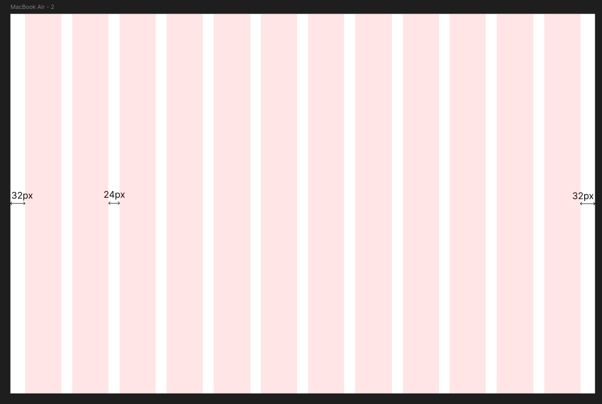

# Grid

O Aurora utiliza um grid responsivo de 12 colunas, projetado para garantir alinhamento consistente entre os elementos visuais e facilitar o desenvolvimento front-end focando no desenvolvimento para desktop.

## Estrutura do Grid

- 12 colunas (desktop)
- Gutters: 24px
- Margens externas: 32px
- Container máximo: 1200px 

<figure markdown="span">  
  { width="1200" }
  <figcaption>Figura 1 - Grid para desktop. Fonte: Autor.</figcaption>
</figure>

## Espaçamentos

Para o espaçamentos dos elementos do sistema será utilado o sistema de 8pt Grid System, dessa forma a interface se manterá a padronização e uma interface limpa.

## Referências 

[1] NANO. The 8-Point Grid e sua malemolência matemática. Medium, 14 fev. 2018. Disponível em: https://medium.com/dex01/the-8-point-grid-e-sua-malemol%C3%AAncia-matem%C3%A1tica-35030ac9f15d. Acesso em: 02 dez. 2025.

## Histórico de versões

    <table>
        <tr>
            <th>Data</th>
            <th>Versão</th>
            <th>Descrição</th>
            <th>Autor</th>
        </tr>
        <tr>
            <td>30/11</td>
            <td>1.0</td>
            <td>Primeira versão finalizada</td>
            <td><a href="https://github.com/ccarlaa">Carla Clementino</a></td>
    </table>

