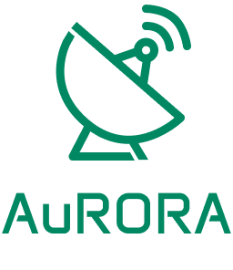

# Logo

## Conceito da marca

A marca AuRORA representa um software desenvolvido para o Laboratório de Telecomunicações da Universidade de Brasília, destinado à Automação de Rastreamento Orbital e Recepção por Antenas. Seu propósito é unificar precisão técnica, controle simplificado e automação inteligente, facilitando o monitoramento e operação das antenas utilizadas para comunicação satelital.

A identidade visual foi pensada para transmitir tecnologia, clareza e confiabilidade, mantendo proximidade estética com a identidade da UnB, mas reinterpretada para um contexto de engenharia e sistemas orbitais.

## Descrição da logo 

A logo da AuRORA combina um símbolo geométrico com uma tipografia moderna, resultando em uma marca simples, direta e fortemente associada ao universo tecnológico.

<figure markdown="span">  
  { width="200" }
  <figcaption>Figura 1 - Logo principal. Fonte: Autor.</figcaption>
</figure>

### Símbolo

O símbolo representa uma antena parabólica estilizada, composta por traços contínuos, angulares e precisos. O desenho comunica, de forma clara:

- Rastreamento (pela inclinação da antena e pela direção do feixe ilustrado);

- Movimento dinâmico (pelos sinais irradiados acima do refletor);

- Ponto de foco (pelo feed circular no centro da parabólica, reforçando a ideia de recepção e emissão);

- Estabilidade e estrutura (pela base firme, com geometria limpa).

A estética linear e minimalista reforça a ideia de software técnico, moderno e confiável, sem sobrecarregar o usuário com ornamentações desnecessárias.

A utilização de linhas de espessura uniforme evoca precisão e engenharia — exatamente o tipo de mensagem esperada para um sistema de telecomunicações orbitais.

### Tipografia

A palavra AuRORA utiliza a fonte ANTA, escolhida pela sua construção geométrica e pelo equilíbrio entre:

-Modernidade

-Firmeza técnica

-Leitura clara em baixa e alta escala

As letras remetem à estrutura modular de sistemas digitais, criando coerência com o ambiente de aplicações técnicas.

O destaque no "Au" inicial (com caixa alta/minúscula) reforça a legibilidade e cria uma identidade particular, ao mesmo tempo que mantém o nome inteiro coeso.

### Harmonia entre símbolo e tipografia

O símbolo da antena e a palavra AuRORA possuem a mesma linguagem visual: traços consistentes, proporções equilibradas e um estilo geométrico coerente. Essa integração garante que a marca:

Seja facilmente reconhecida;

Transmita seriedade técnica e facilidade de uso;

Possa ser aplicada em diferentes escalas (interfaces, manuais, dashboards, placas do laboratório).

A composição foi projetada para ser funcional tanto em aplicações digitais quanto impressas, sem perda de clareza ou de impacto.

## Formas de Utilização da Logo

A correta aplicação da marca AuRORA garante consistência, reconhecimento e profissionalismo em todas as interfaces onde o software é apresentado. Para evitar distorções e preservar a integridade visual da marca, devem ser observadas cuidadosamente as diretrizes abaixo.

### Versão Principal

<figure markdown="span">  
  { width="200" }
  <figcaption>Figura 2 - Logo principal. Fonte: Autor.</figcaption>
</figure>

A versão principal da logo consiste no símbolo da antena acompanhado da palavra AuRORA abaixo dele.
Esta é a forma preferencial de uso e deve ser aplicada:

- Interfaces do software

- Telas de login

- Documentação técnica

- Apresentações

- Materiais institucionais

- Páginas de carregamento ou dashboards

Deve ser utilizada sempre que houver espaço suficiente para manter equilíbrio visual e legibilidade.

### Versão Horizontal

<figure markdown="span">  
  { width="400" }
  <figcaption>Figura 3 - Logo horizontal. Fonte: Autor.</figcaption>
</figure>

A versão horizontal organiza o símbolo à esquerda e o nome AuRORA à direita.
É indicada para:

- Cabeçalhos de sites

- Navbars

- Assinaturas de e-mail

- Documentos com espaço limitado na vertical

Essa versão mantém a mesma proporção e espessura de linhas da marca vertical.

### Versão Reduzida (Símbolo Isolado)

<figure markdown="span">  
  { width="150" }
  <figcaption>Figura 3 - Logo reduzida. Fonte: Autor.</figcaption>
</figure>

O símbolo da antena pode ser utilizado sem o logotipo textual em situações de escala reduzida ou quando a marca já está estabelecida visualmente no contexto.

- Usar o símbolo isolado somente quando:

- Espaço for muito limitado (favicons, ícones, avatares, botões, marcadores)

- A aplicação já estiver dentro do ambiente visual do software

Em elementos gráficos repetitivos (ex.: loading indicator, selo, padrão de fundo)

Nunca substituir o logotipo principal por essa versão em materiais formais ou institucionais.

### Proporções

As proporções entre símbolo e texto não devem ser alteradas.
É proibido:

- Esticar

- Achatar

- Redimensionar partes separadamente

- Modificar alinhamentos

A logo deve sempre ser redimensionada como um único objeto.

### Usos Incorretos

Para evitar descaracterização da marca, não é permitido:

- Alterar as cores institucionais
- Rotacionar a logo
- Modificar espessura de linha
- Aplicar sombras, brilhos ou efeitos 3D
- Deformar proporções
- Colocar a logo sobre fundos com baixo contraste
- Usar opacidade parcial (exceto em marcas d’água controladas)
- Preencher o símbolo com padrões ou texturas
- Substituir a tipografia original

Essas práticas comprometem a legibilidade e a consistência visual da marca.

## Histórico de versões

    <table>
        <tr>
            <th>Data</th>
            <th>Versão</th>
            <th>Descrição</th>
            <th>Autor</th>
        </tr>
        <tr>
            <td>27/11</td>
            <td>1.0</td>
            <td>Primeira versão finalizada</td>
            <td><a href="https://github.com/ccarlaa">Carla Clementino</a></td>
    </table>

