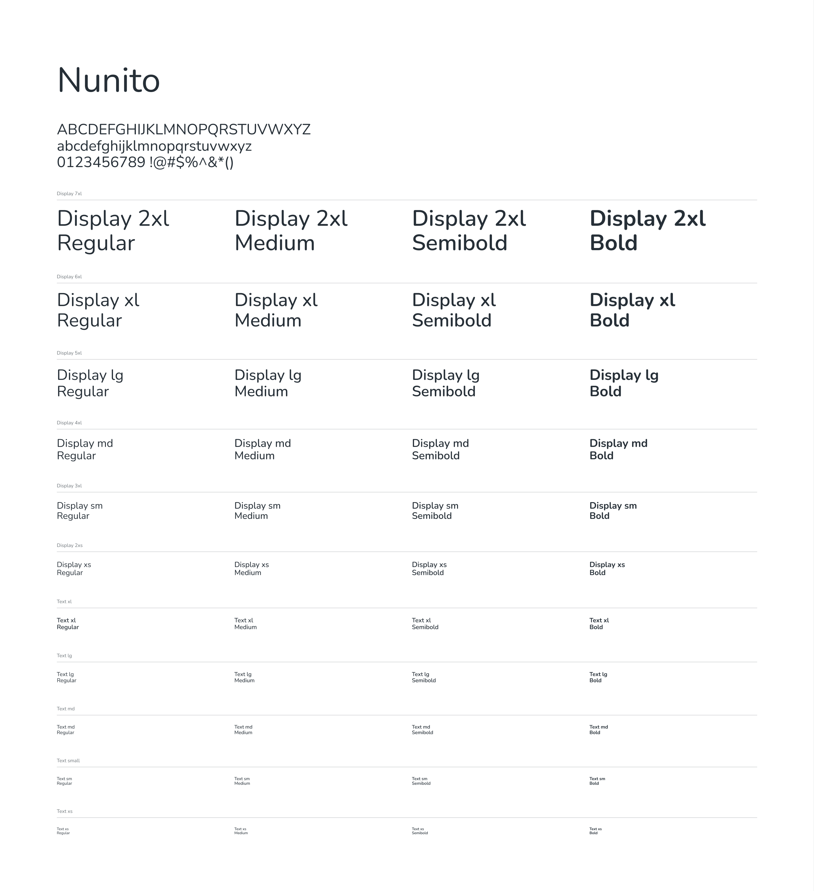

# Fontes

Foram escolhidas duas fontes para compor oo projeto: Nunito e Anta. A fonte Anta faz parte da marca e junto com a logo transmite o objetivo da marca. A fonte Nunito é utilizada para a interface do software tendo em vista seu design limpo e sua grande gama de pesos, o que permite a implementação de uma hierarquia tipográfica e assim guia o usuário ao longo da aplicação.

## Fonte Anta

Exclusivo da logomarca e aplicações especiais.

### Recomendações

- Usar apenas em tamanhos grandes.
- Evitar o uso em textos corridos.
- Evitar uso em botões, labels ou elementos funcionais.

### Pesos 

<iframe style="border: 1px solid rgba(0, 0, 0, 0.1);" width="1000" height="650" src="https://embed.figma.com/design/uSwWcg7KcUNIemEtedc6h1/Untitled?node-id=45-108&embed-host=share" allowfullscreen></iframe>

    <figcaption>Quadro 1 - Fonte Anta. Fonte: Autor.</figcaption>

<figure markdown="span">  
  { width="600" }
  <figcaption>Figura 1 - Fonte Anta. Fonte: Autor.</figcaption>
</figure>

## Fonte Nunito

Utilizado em interface, textos, títulos, parágrafos e documentação.

### Recomendações

- Usar em todo o conteúdo textual da plataforma.
- Ideal para formulários, botões, tabelas e elementos interativos.

### Pesos 

<iframe style="border: 1px solid rgba(0, 0, 0, 0.1);" width="800" height="450" src="https://embed.figma.com/design/uSwWcg7KcUNIemEtedc6h1/Untitled?node-id=45-10&embed-host=share" allowfullscreen></iframe>

    <figcaption>Quadro 2 - Fonte Nunito. Fonte: Autor.</figcaption>

<figure markdown="span">  
  { width="600" }
  <figcaption>Figura 2 - Fonte Nunito. Fonte: Autor.</figcaption>
</figure>

## Histórico de versões

    <table>
        <tr>
            <th>Data</th>
            <th>Versão</th>
            <th>Descrição</th>
            <th>Autor</th>
        </tr>
        <tr>
            <td>30/11</td>
            <td>1.0</td>
            <td>Primeira versão finalizada</td>
            <td><a href="https://github.com/ccarlaa">Carla Clementino</a></td>
    </table>

