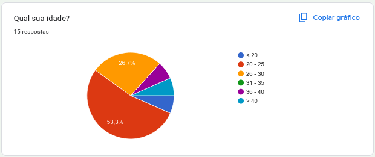
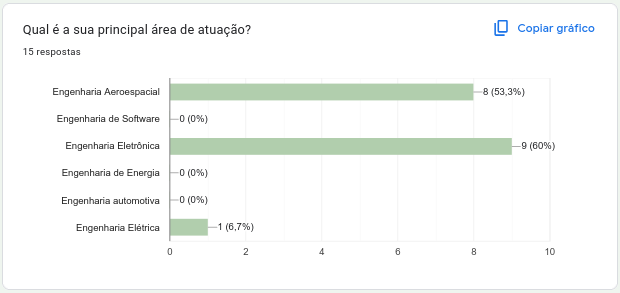
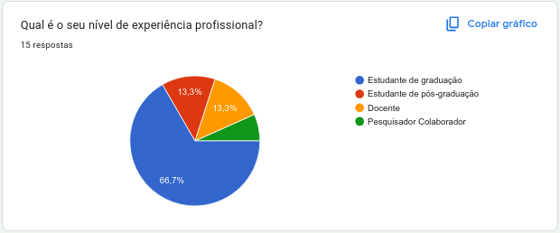
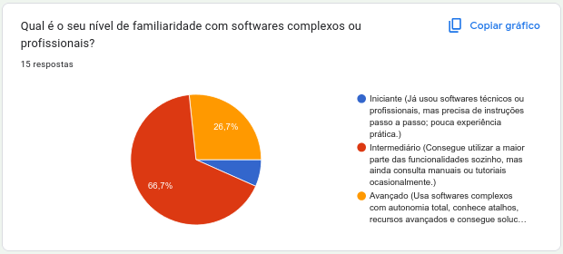
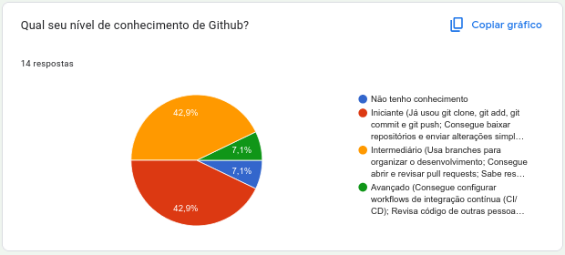

# Formulário de perfil do usuário

O presente artefato descreve a técnica de formulário utilizada para a definição do perfil do usuário do software AuRORA.

## Metodologia

O stakeholder de uma aplicação pode ser definido como um grupo ou indivíduo que pode ser afetado pela realização do propósito de uma organização. No ponto de vista de software, podemos dizer que os stakeholders são definidos como os grupos ou indivíduos que são afetados pelo desenvolvimento do sistema.

Segundo a norma ISO 42.010 de 2022 alguns exemplos típicos que devem ser considerados, quando aplicável, são:

<ul>
    <li> Usuários do sistema. </li>
    <li> Operadores do sistema. </li>
    <li> Adquirentes do sistema. </li>
    <li> Proprietários do sistema. </li>
    <li> Fornecedores do sistema. </li>
    <li> Desenvolvedores do sistema. </li>
    <li> Construtores do sistema. </li>
    <li> Mantenedores do sistema. </li>
</ul>

No escopo do projeto, algumas dessas difinições se fundem, tendo em mente que os usuários do software também serão os responsável por realizar a manutenção do sistema. Dessa forma, conseguimos identificar 4 tipos de usuário no sistema AuRORA: usuários do sistema, operadores do sistema, desenvolvedores do sistema e mantenedores do sistema. Com base nisso, foi aplicada a metodologia de formulário para coletar informações sobre os stakeholders com foco em seus conhecimentos técnicos e práticos, de forma a utilizar os dados para a tomada de decisões técnicas que facilitem a manutenção futura do software.

### 1ª Etapa

#### Instrumento de Coleta

Foi desenvolvido um formulário estruturado com o objetivo de:

- Identificar o perfil demográfico e profissional dos usuários
- Mapear o conhecimento técnico dos usuaŕios

#### Estrutura do Formulário

O formulário foi organizado em seções específicas:

##### 1. Termo de Consentimento 
- Consentimento por parte do usuário da utilização de seus dados para pesquisa e desenvolvimento.

##### 2. Perfil Demográfico
- Nome completo.
- E-mail.
- Idade.
- Gênero.
- Área de atuação.
- Nível de experiência profissional.
- Utiliza aparelhos pessoais ou os fornecidos no laboratório.

##### 3. Conhecimentos técnicos
- Possui experiência com programação.
- Possui familiaridade com softwares complexos.
- Utiliza qual sistema operacional.
- Linguagens que possui afinidade (domínio da sintaxe, compreensão dos paradigmas, capaz de utilizar bibliotecas).
- Quais frameworks frontend possui familiaridade (realizou ao menos um projeto utilizando a tecnologia).
- Quais frameworks backend possui familiaridade (realizou ao menos um projeto utilizando a tecnologia).
- Quais bibliotecas possui familiaridade (realizou ao menos um projeto utilizando a tecnologia).
- Qual o nível de conhecimento de Github.
- Quais bancos de dados relacionais possui familiaridade.
- Quais bancos de dados não relacionais possui familiaridade.
- Possui familiaridade com containers.

#### Processo de Aplicação

1. **Divulgação**: O formulário foi distribuído através de WhatsApp para os potenciais usuários do sistema
2. **Período de coleta**: Disponibilizado por 2 dias.
3. **Acompanhamento**: Lembretes enviados para aumentar taxa de resposta
4. **Validação**: Respostas verificadas quanto à completude e consistência

## Resultados

Foram coletados dados de 15 participantes dos quais todos estão de acordo com o termo de consentimento, como pode ser observado na Figura 1.

<figure markdown="span">  
  <figcaption>Figura 1 - Termo de Consentimento dos Stakeholders.</figcaption>
  { width="600" }
  <figcaption>Fonte: Autor.</figcaption>
</figure>

A Figura 1 demonstra que todos os 15 participantes da pesquisa concordaram com o termo de consentimento para a utilização de seus dados.

Os resultados coletados podem ser vistos nas figuras abaixo:

<figure markdown="span">  
  <figcaption>Figura 2 - Idade dos Stakeholders.</figcaption>
  { width="600" }
  <figcaption>Fonte: Autor.</figcaption>
</figure>

A Figura 2 apresenta a distribuição de idade dos stakeholders, evidenciando que a grande maioria (80%) está na faixa etária de 20 a 24 anos, o que sugere um público jovem e familiarizado com tecnologias recentes.

<figure markdown="span">  
  <figcaption>Figura 3 - Gênero dos Stakeholders.</figcaption>
  { width="600" }
  <figcaption>Fonte: Autor.</figcaption>
</figure>

A Figura 3 detalha a distribuição de gênero, com 80% dos participantes se identificando como masculino, 13,3% como feminino e 6,7% preferindo não informar.

<figure markdown="span">  
  <figcaption>Figura 4 - Área de Atuação dos Stakeholders.</figcaption>
  { width="600" }
  <figcaption>Fonte: Autor.</figcaption>
</figure>

A Figura 4 ilustra as áreas de atuação dos participantes. A maioria (60%) atua no desenvolvimento de software, seguido por design/UX (13,3%) e outros.

<figure markdown="span">  
  <figcaption>Figura 5 - Experiência Profissional dos Stakeholders.</figcaption>
  { width="600" }
  <figcaption>Fonte: Autor.</figcaption>
</figure>

A Figura 5 mostra a experiência profissional dos stakeholders. Nota-se que 40% estão em início de carreira (até 2 anos de experiência), enquanto 33,3% possuem mais de 10 anos de experiência, indicando um grupo heterogêneo.

<figure markdown="span">  
  <figcaption>Figura 6 - Tipo de Computador dos Stakeholders.</figcaption>
  { width="600" }
  <figcaption>Fonte: Autor.</figcaption>
</figure>

A Figura 6 indica que 86,7% dos participantes utilizam computadores pessoais para o trabalho, enquanto 13,3% utilizam equipamentos fornecidos pelo laboratório.

<figure markdown="span">  
  <figcaption>Figura 7 - Experiência com Software dos Stakeholders.</figcaption>
  { width="600" }
  <figcaption>Fonte: Autor.</figcaption>
</figure>

A Figura 7 revela que a maioria dos participantes (60%) se considera familiarizada com softwares complexos, um dado importante para o design da interface do AuRORA.

<figure markdown="span">  
  <figcaption>Figura 8 - Sistema Operacional dos Stakeholders.</figcaption>
  { width="600" }
  <figcaption>Fonte: Autor.</figcaption>
</figure>

A Figura 8 aponta os sistemas operacionais mais utilizados, com destaque para o Windows (60%) e o Linux (40%). O macOS também é utilizado por 20% dos participantes.

<figure markdown="span">  
  <figcaption>Figura 9 - Linguagem de Programação dos Stakeholders.</figcaption>
  { width="600" }
  <figcaption>Fonte: Autor.</figcaption>
</figure>

A Figura 9 destaca as linguagens de programação de preferência. JavaScript e Python são as mais populares, ambas com 66,7% de afinidade, seguidas por TypeScript (40%) e Java (33,3%).

<figure markdown="span">  
  <figcaption>Figura 10 - Frameworks dos Stakeholders.</figcaption>
  { width="600" }
  <figcaption>Fonte: Autor.</figcaption>
</figure>

A Figura 10 apresenta a familiaridade com frameworks. No frontend, React (60%) e Angular (26,7%) são os mais conhecidos. No backend, Node.js (53,3%) e Spring (20%) se destacam.

<figure markdown="span">  
  <figcaption>Figura 11 - Bibliotecas dos Stakeholders.</figcaption>
  { width="600" }
  <figcaption>Fonte: Autor.</figcaption>
</figure>

A Figura 11 mostra as bibliotecas com as quais os stakeholders têm familiaridade. Pandas (46,7%) e NumPy (40%) são as mais citadas, indicando uma inclinação para análise de dados.

<figure markdown="span">  
  <figcaption>Figura 12 - Nível de Conhecimento em Github dos Stakeholders.</figcaption>
  { width="600" }
  <figcaption>Fonte: Autor.</figcaption>
</figure>

A Figura 12 demonstra o nível de conhecimento em Git e GitHub. A maioria (66,7%) se considera em nível intermediário, enquanto 20% se avaliam como avançados.

<figure markdown="span">  
  <figcaption>Figura 13 - Conhecimento em SQL dos Stakeholders.</figcaption>
  { width="600" }
  <figcaption>Fonte: Autor.</figcaption>
</figure>

A Figura 13 informa sobre a familiaridade com bancos de dados relacionais. PostgreSQL (60%) e MySQL (53,3%) são os mais conhecidos.

<figure markdown="span">  
  <figcaption>Figura 14 - Conhecimento em NoSQL dos Stakeholders.</figcaption>
  { width="600" }
  <figcaption>Fonte: Autor.</figcaption>
</figure>

A Figura 14, por sua vez, mostra a familiaridade com bancos de dados não relacionais. MongoDB é o mais conhecido, com 46,7% de familiaridade.

<figure markdown="span">  
  <figcaption>Figura 15 - Conhecimento em Docker dos Stakeholders.</figcaption>
  { width="600" }
  <figcaption>Fonte: Autor.</figcaption>
</figure>

A Figura 15 indica que 60% dos participantes possuem familiaridade com a tecnologia de contêineres Docker, um aspecto relevante para a infraestrutura do projeto.

## Resultados e Impacto

A aplicação do formulário permitiu:

- **Validação de hipóteses** sobre as necessidades dos usuários
- **Descoberta de requisitos** não previamente considerados
- **Priorização objetiva** das funcionalidades a desenvolver
- **Definição de métricas de sucesso** para o projeto

## Considerações Éticas

- Participação voluntária e consentimento informado
- Anonimização dos dados coletados
- Uso exclusivo para fins do desenvolvimento do projeto
- Transparência sobre o uso das informações

## Limitações

- Amostra limitada ao contexto institucional específico
- Possível viés de seleção dos respondentes

## Referência

[1] FREEMAN, R. Edward. Strategic management: a stakeholder approach. Marshfield, Massachusetts: Pitman Publishing, 1984.

## Histórico de versões

    <table>
        <tr>
            <th>Data</th>
            <th>Versão</th>
            <th>Descrição</th>
            <th>Autor</th>
        </tr>
        <tr>
            <td>31/10</td>
            <td>1.0</td>
            <td>Primeira versão finalizada</td>
            <td><a href="https://github.com/ccarlaa">Carla Clementino</a></td>
    </table>

